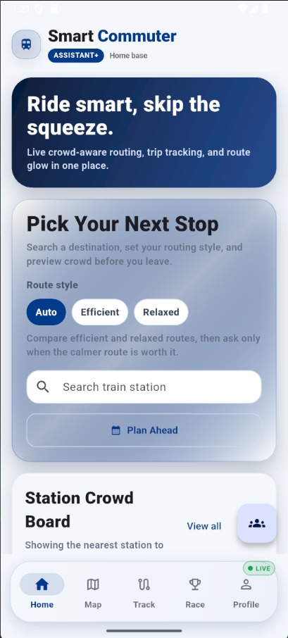
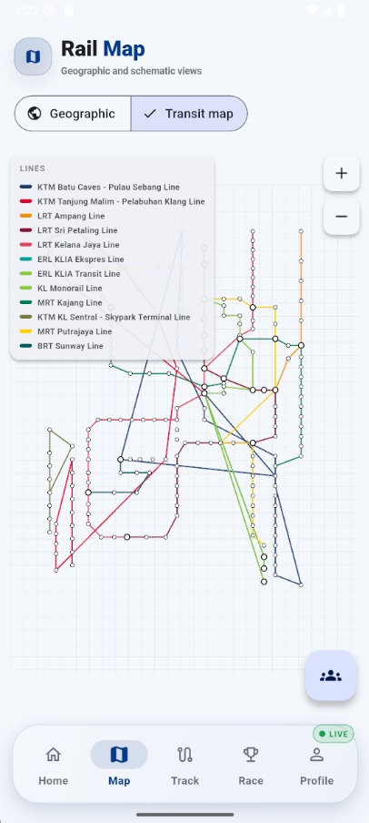
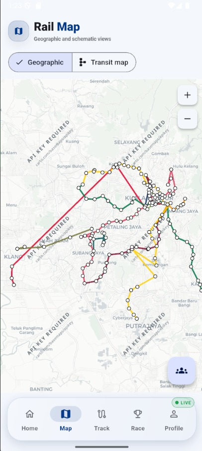
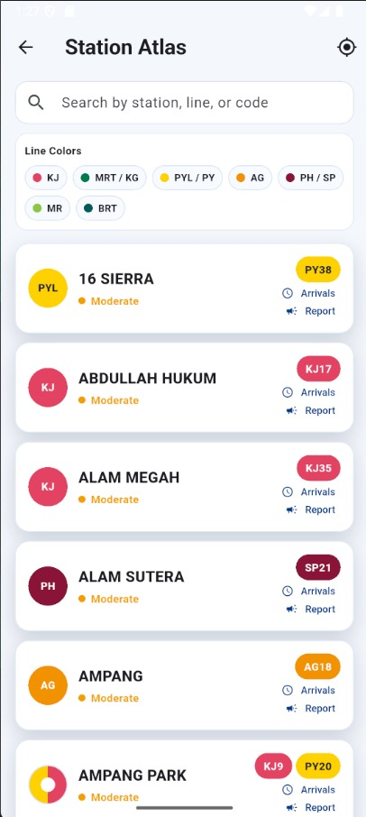
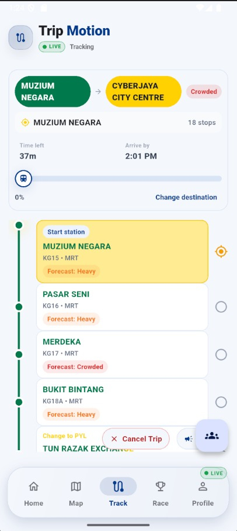
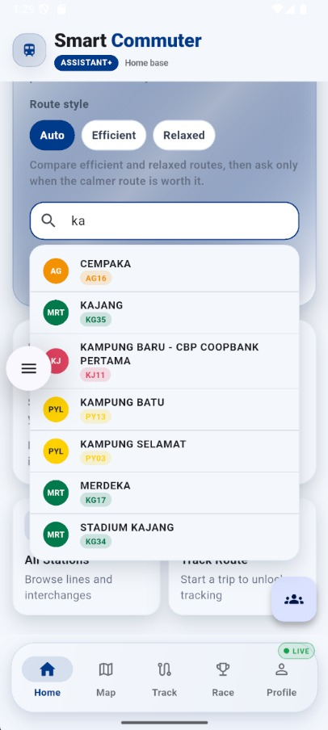
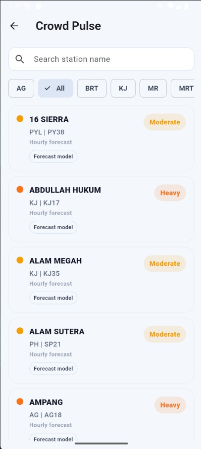
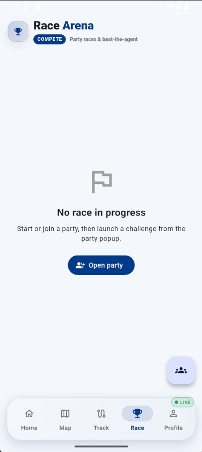
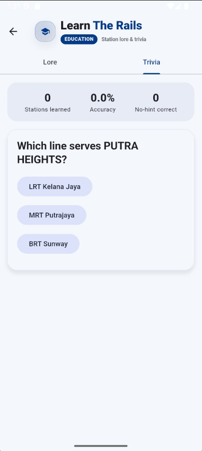
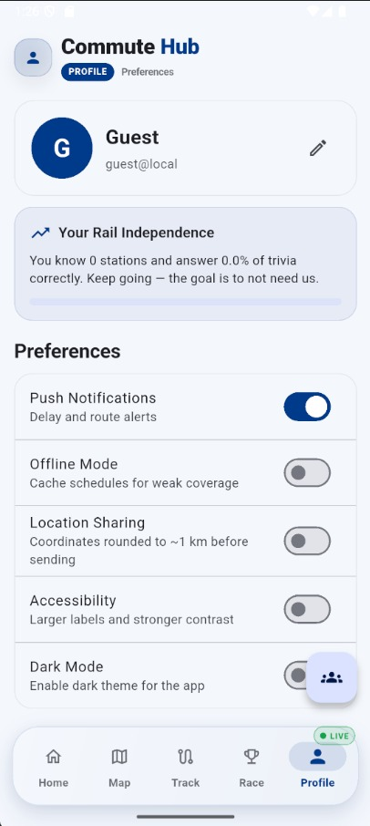

# Smart Commuter Assistant+

> Your friendly neighbourhood (and by "neighbourhood" we mean the whole Klang Valley) transit copilot.

A Flutter app that helps you navigate Malaysia's Klang Valley rail network with live crowd levels, jam-free ETAs, and route planning that actually understands the difference between "five minutes" and "five minutes but you're standing in someone's armpit."

---

## What is this?

Smart Commuter Assistant+ is a mobile app for rail commuters. It answers the three questions every Klang Valley rider asks daily:

1. **How do I get from A to B?** — multi-line route planning across LRT, MRT, Monorail, BRT and KTM.
2. **How crowded will it be?** — hourly crowd forecasts blended with live rider reports.
3. **When will I *actually* arrive?** — a steady, no-jitter ETA that doesn't gaslight you as you walk.

It runs on Flutter (phone), talks to a FastAPI backend, and leans on Supabase/Postgres for storage and a Python ML pipeline that churns out crowd forecasts on a schedule.

---

## The big picture (how it all fits together)

```
                  ┌────────────────────────────────────────────┐
                  │                Flutter app                 │
                  │  screens · map · planner · ETA · crowd     │
                  └──────────────┬─────────────────────────────┘
                                 │ HTTP (REST)
                  ┌──────────────▼─────────────────────────────┐
                  │            FastAPI backend                  │
                  │  /plan-trip · /arrivals · /crowd · /trip   │
                  └───────┬──────────────────────┬─────────────┘
                          │                      │
                 ┌────────▼────────┐    ┌────────▼────────┐
                 │ Supabase (Postgres) │  │ GTFS static feed │
                 │  crowds · stops ·   │  │  rapid-rail-kl   │
                 │  forecasts · trips  │  │  scheduled times │
                 └────────▲────────┘    └──────────────────┘
                          │
                 ┌────────┴────────┐
                 │ Python ML (cron) │  ← GitHub Actions every 6h / daily
                 │ train · predict · │
                 │ upsert forecasts  │
                 └──────────────────┘
```

The flow, in human terms:

1. **Data in** — a station/network catalog is built from `train_stops_kl.csv` + `transit_network.json`, and scheduled arrivals come from Malaysia's official GTFS feed.
2. **Brains in the cloud** — Python scripts train a crowd model and upsert hourly forecasts into Supabase.
3. **Crowd-sourced reality** — riders submit reports (geo-fenced, rate-limited, consensus-checked), which get blended over the ML forecast.
4. **Answers out** — the app plans routes, shows forecasts, and tracks your live trip with a pinned ETA.

---

## Features

### Core
- **Route planning** across the whole Klang Valley network with interchange handling and three profiles (fastest / balanced / comfort).
- **Crowd forecast board** — hourly occupancy levels (1–5) per station, with expected wait times.
- **Live rider reports** — crowd + delay reports, blended into the forecast with time-decay (a report from 5 minutes ago matters more than one from 2 hours ago — shocking, we know).
- **Nearby stations** — GPS finds your closest stations and their crowd status.
- **Scheduled arrivals** — real timetable data from the official GTFS feed, with a local fallback.
- **Interactive transit map** — a Rapid Pulse-style schematic map with tappable stations, pulsing selections and route highlighting.
- **Geographic map** — real OpenStreetMap tiles with station markers and line polylines.
- **Active trip tracking** with a pinned, countdown-style ETA.
- Favorites, recent searches, travel history, light/dark theme, and Supabase auth (guest + email/password).

### Anti-reset & anti-fraud crowd system
Because "the crowd level is 5" from someone 3 km away in their living room is not data — it's fiction:

- **Append-only reports** — nothing overwrites history; every report is a new row.
- **Time-decay blending** — `get_blended_crowd_level()` mixes the ML forecast (40%) with age-weighted user reports (60%), falling back to a 14-day historical average.
- **Daily snapshots** — `snapshot_daily_blend()` preserves blended levels into `historical_crowds`.
- **Geo-fencing** — you must be within **500 m** of the station to report (enforced server- and client-side).
- **Rate limiting** — one report per station per user every **2 hours**.
- **Consensus** — extreme reports (1 or 4–5) need corroboration within 30 minutes, or they're flagged "unverified".

### Offline & resilience
- SQLite local cache (transit stops, connections, favorites, history) via `sqflite`.
- Automatic fallback to local graph routing when the backend is unreachable.
- Connectivity-aware refreshes and network banners.

---

## Screens — a tour of the app

> **Screenshots:** the shots below live in `docs/screenshots/`. Features marked **Work in progress** are still being built out.

### Home (`lib/screens/home_screen.dart`)
Your dashboard and the app's front door. Shows nearby station arrivals, a quick plan-launch, and crowd highlights. Also hosts the "Plan Ahead" flow and the location-privacy prompt (Allow or Skip — we won't judge, but the GPS will).



### Map (`lib/screens/map_screen.dart`)
Two maps, one screen — toggled with a segmented button:
- **Transit map** — a Rapid Pulse-style schematic (`interactive_schematic_map.dart`) with tappable stations, pulsing selected stops, and thick highlighted route polylines.
- **Geographic map** — real OpenStreetMap tiles with station markers and coloured line polylines.

Both views share the same selection + route-planning state (`MapSelectionController`), so tapping a station works identically in either.





> **Work in progress** — the map views are still being refined.

### Station Atlas (`lib/screens/stations_screen.dart`)
Search and browse every station, then plan a trip with **Leave Now** or **Choose Date & Time**. Also the home of the "How crowded is it now?" report flow.



### Track Route (`lib/screens/track_route_screen.dart`)
The live-trip cockpit. Shows the pinned countdown ETA, your stops along the way, and options to change or cancel your destination. On arrival it prompts for feedback so the model can learn from your commute.



### Route Builder (`lib/screens/route_builder_screen.dart`)
Plan a route with assisted suggestions or full manual control over every waypoint.



### Crowd Pulse (`lib/screens/station_crowd_board_screen.dart`)
A per-station crowd board — the 1–5 occupancy level for a station, its source (forecast vs live rider report), and recent activity.

### Crowd Outlook (`lib/screens/crowd_forecast_screen.dart`)
The hourly forecast view — what the model thinks each station will look like hour by hour, so you can pick a commute time that doesn't involve being a sardine.



### Race (`lib/screens/race_screen.dart`)
"Race Arena" — party races and beat-the-agent challenges with friends.



> **Work in progress** — racing is still being polished.

### Learn the Rails (`lib/screens/education_screen.dart`)
Station lore and trivia that teach you the network, one stop at a time.



> **Work in progress** — education content is still growing.

### Friends (`lib/screens/friends_screen.dart`)
Find friends by handle and see who's commuting alongside you.


> **Work in progress** — social features are still being built out.

### Login (`lib/screens/login_screen.dart`)
Email/password sign-in, **Sign in with Google**, **Continue as guest**, and a link to **Create account**. Because not everyone wants a relationship with an app.

### Sign Up (`lib/screens/signup_screen.dart`)
"Create Your Pass" — the account creation flow. No loyalty points yet, but your favourites sync.

### Profile (`lib/screens/profile_screen.dart`)
Preferences (push notifications, offline mode, location sharing, accessibility, dark mode), data attributions (map tiles, weather, transit schedule), quick actions, and logout.



---

## Routing engine — how the app picks your route

The heart of the planner is a **Dijkstra shortest-path** search over a graph of stations and edges. Here's what it knows and how it weighs things:

### The graph
- **Nodes** = stations (233 in the network).
- **Edges** = line segments between adjacent stops, plus **interchange edges** connecting different lines at the same station.
- Every edge carries a travel time (minutes).

### The magic numbers
| Ingredient | Value |
|---|---|
| Line-transfer penalty | **8 minutes** (app) / 0–5 depending on profile (backend) |
| Walking pace to your origin station | **80 m/min** |
| Interchange transfer time | **3 minutes** (backend) |
| Travel time estimate | haversine distance ÷ 0.55 km/min (clamped 2–8 min) |

### Three route profiles (backend)
| Profile | Transfer penalty | Crowd penalty | Meaning |
|---|---|---|---|
| `fastest` | 0 | 0 | Pure speed — transfers are free, crowds are ignored |
| `balanced` | 2 | 1 | The Goldilocks option |
| `comfort` | 5 | 2 | Avoids transfers and crowded trains, time be damned |

### What a route "costs"
The planner minimises a weighted cost, not just raw minutes. On top of Dijkstra, the app's simulated ML engine re-ranks candidates using:
- Predicted delay (rain, peak hours, station demand, line congestion).
- Crowd penalty (Light +1, Moderate +3, Crowded +6).
- Transfer penalty (+1.8 per transfer).

### Fare (a rough estimate, not an official one)
```
fare = clamp(1.4 + (distance_km × 0.13) + (transfers × 0.35), 1.4, 8.0)
```

> Dijkstra is named after Edsger Dijkstra, who — if he'd had to commute on the LRT during rush hour — would absolutely have added a "stand near the door" penalty too.

---

## Crowd intelligence — where the numbers come from

Crowd levels are a **1–5 scale**: `1` Empty · `2` Light · `3` Moderate · `4` Heavy · `5` Crowded.

Each level maps to an expected wait and an ETA multiplier (because a crowded platform means you might not board the first train):

| Level | Expected wait | ETA multiplier |
|---|---|---|
| 1 | 2 min | 1.00 |
| 2 | 4 min | 1.05 |
| 3 | 6 min | 1.12 |
| 4 | 8 min | 1.22 |
| 5 | 10 min | 1.35 |

### Three sources, one number
1. **ML forecast** (`crowd_forecast_hourly`) — the model's best guess per stop/hour/day-of-week, generated by a cron job.
2. **Live rider reports** (`crowd_reports`) — real people, real stations, geo-fenced.
3. **Historical blends** (`historical_crowds`) — the daily snapshot of what actually happened, so the blend has a memory.

The final displayed level is a **blend**: forecast (40%) + fresh user reports (60%), with report weight decaying by age. A report 5 minutes old is worth ~0.75; 2 hours old, ~0.

---

## ETA — the "pin & countdown" philosophy

A boring GPS recalculates your ETA every second, which is why it says "12 min", then "8 min", then "you missed it." Smart Commuter Assistant+ does the opposite:

1. When you come within **100 m** of your origin station, the ETA is **pinned once** as a wall-clock arrival time.
2. The display is simply `pinnedArrivalTime − now` — a steady countdown, no jitter.
3. It only re-pins on real events: a **delay report**, a **crowd report** (extra wait), or a **reroute**.
4. Background forecast refreshes never touch the displayed ETA.
5. On arrival, the app submits `trip_feedback` (predicted vs actual) so the model can learn how wrong it was.

---

## Data — where it lives

### Where data comes from
| Data | Source |
|---|---|
| Station catalog / network | `scripts/train_stops_kl.csv`, `app/assets/data/transit_network.json` (233 stations, 656 connections) |
| Schematic map layout | `app/assets/schematic_layout.json` (100×140 grid) |
| Map background | `app/assets/images/klang_valley_map.jpeg` |
| Scheduled arrivals | Malaysia GTFS static feed `rapid-rail-kl` (parsed by `gtfs_service.py`) |
| Crowd forecasts | Python ML pipeline (synthetic-then-real training data) |
| Crowd reports | Riders via the app |
| Trip feedback | Riders on arrival |

### Where data is stored (Supabase / Postgres)
| Table | Purpose |
|---|---|
| `transit_stops` | station catalog |
| `route_connections` | graph edges between stops |
| `crowd_reports` | append-only log of user reports |
| `crowd_forecast_hourly` | ML forecast baselines |
| `historical_crowds` | daily blended snapshots |
| `trip_feedback` | predicted-vs-actual per trip, for ML retraining |

Plus a **SQLite** local cache on-device for offline use.

> Supabase's free tier auto-pauses after 7 days of inactivity, so a keepalive cron pokes it every 3 days. Yes, we have a bot whose entire job is to keep the database from taking a nap.

---

## Project structure

The full file-by-file index lives in [`PROJECT_FILES.txt`](PROJECT_FILES.txt). The short version:

```
.
├── app/                 # Flutter app (lib/, assets/, env/, test/)
│   ├── lib/
│   │   ├── constants/   # route_colors.dart, crowd_levels.dart, shadows
│   │   ├── models/      # transit_graph.dart (Dijkstra), route_info, etc.
│   │   ├── screens/     # home, map, track_route, stations, crowd, auth…
│   │   ├── services/    # planner, crowd, arrivals, ETA, ML, auth, cache…
│   │   └── widgets/     # interactive_schematic_map, cards, panels
│   └── assets/          # data JSON, GTFS schedule, map image
├── backend/             # FastAPI (main.py, gtfs_service, crowd_service)
├── scripts/             # Python ML + SQL + data gen (see below)
├── supabase/            # DB migrations + RLS policies
├── tests/               # Python tests
├── docker/              # ML worker container
├── .github/workflows/   # CI, crowd-forecast, retrain, snapshot, deploy
├── Dockerfile           # backend image
└── docker-compose.yml
```

### Python scripts (the ML side)
| Script | Job |
|---|---|
| `aggregate_training_data.py` | pulls real `crowd_reports` + `trip_feedback`, builds a feature matrix |
| `train_crowd_model.py` | trains the crowd model (scikit-learn / LightGBM / XGBoost / Optuna) |
| `predict_and_upsert_crowd.py` | predicts + upserts `crowd_forecast_hourly` |
| `run_daily_pipeline.py` | orchestrates aggregate → train → predict+upsert |
| `build_and_upsert_hourly_forecast.py` | builds the hourly forecast grid (crowd-forecast cron) |

---

## Run it yourself

Get the app running on your own machine in a few steps. The app runs even with no backend or Supabase — it falls back to local "guest" mode and local graph routing.

### Prerequisites
- **Flutter SDK 3.x** — [install guide](https://docs.flutter.dev/get-started/install)
- **Android Studio** (for the emulator) or a physical Android device with USB debugging
- **Python 3.10+** — only needed for the FastAPI backend or the ML pipeline
- **Git**

### 1. Clone & install Flutter deps
```bash
git clone https://github.com/DataMiningSoftware/SmartCommuterAssistance.git
cd SmartCommuterAssistance/app
flutter pub get
```

### 2. Configure the app
```bash
cd app
Copy-Item env/dev.template.json env/dev.json
```
Fill in `env/dev.json`:

| Key | Value |
|---|---|
| `SUPABASE_URL` | your Supabase project URL |
| `SUPABASE_ANON_KEY` | your Supabase anon/publishable key |
| `BACKEND_URL` | `http://127.0.0.1:8000` (local) or your deployed backend URL |
| `SENTRY_DSN` | `""` for local development |

> `env/dev.json` is gitignored — don't commit real keys.

### 3. Run it
```bash
cd app
flutter run --dart-define-from-file=env/dev.json
```
Then pick an emulator or plug in a phone. From the Android emulator, a local backend is reachable at `http://10.0.2.2:8000` (set `BACKEND_URL` accordingly).

### 4. Set up Supabase (for accounts, crowd reports & sync)
1. Create a free project at [supabase.com](https://supabase.com).
2. Import the station catalog: **Table Editor → Import data** → upload `scripts/train_stops_kl.csv` as table `train_stops_kl`.
3. Run the SQL setup in order: the base schema files in `scripts/`, then the migrations in `supabase/`. The full ordered list is in [`app/README.md`](app/README.md#supabase-setup).
4. **Authentication → Sign In / Providers → Email** → enable it, and turn **OFF** "Confirm email" if you want instant sign-ups while developing.

### 5. (Optional) Run the FastAPI backend
```bash
cd backend
Copy-Item ..\.env.example .env   # fill SUPABASE_URL + SUPABASE_SERVICE_KEY
pip install -r requirements.txt
python -m uvicorn main:app --reload --host 0.0.0.0 --port 8000
```
Health check → `http://127.0.0.1:8000/health` · Swagger docs → `http://127.0.0.1:8000/docs`

### 6. (Optional) Enable Google sign-in
1. **Authentication → Sign In / Providers → Google** → enable it with your Google OAuth **Client ID** and **Client secret** (from [Google Cloud Console](https://console.cloud.google.com/apis/credentials)).
2. **Authentication → URL Configuration** → add redirect URL `com.nawfal.smartcommuter://login-callback`.

### Tests
```bash
pytest tests/              # Python (from repo root)
cd app && flutter test     # Flutter
cd app && dart analyze lib/
```

---

## Environment variables

Copy `.env.example` → set `SUPABASE_URL` and `SUPABASE_SERVICE_KEY`. The Flutter app reads its config from `app/env/dev.json` (`dev.template.json` is the template) — it's JSON, not `.env`, because we're fancy like that. Never put the service-role key in a Dart-define file; it belongs on the backend/worker only.

---

## Deployment

- **App** → `flutter build appbundle --release` → Google Play Console.
- **Backend** → Google Cloud Run (or Render): `gcloud run deploy smart-commuter-backend --source=. --region=asia-southeast1 --port=8000 --allow-unauthenticated`.
- **Cron / ML** → GitHub Actions (`crowd-forecast.yml`, `retrain-pipeline.yml`, `snapshot-daily-blend.yml`) write to Supabase.

---

## Backend API

| Method | Path | Description |
|---|---|---|
| GET | `/health` | health check + GTFS metadata |
| GET | `/stations` | list stations |
| GET | `/plan-trip` | route planning (Dijkstra, 3 profiles) |
| GET | `/arrivals/station/{stop_id}` | scheduled arrivals |
| GET | `/arrivals/nearest` | nearest station + arrivals from GPS |
| POST | `/crowd/report` | submit crowd report (geo-fenced, rate-limited, consensus) |
| GET | `/crowd/blend` | blended crowd level |
| POST | `/trip/feedback` | record predicted vs actual |

---

## Gotchas worth knowing

- **Three line-ID systems coexist** (schematic keys `'1'..'12'` ↔ graph IDs `KT1/KT2/…` ↔ normalized IDs `KJ/MRT/PYL/…`). If you add a line, map it in `route_colors.dart`.
- **Route line IDs:** `KJ` (Kelana Jaya) · `MRT`/`KG` (Kajang) · `PYL`/`PY` (Putrajaya) · `AG`/`SP`/`PH` (Ampang/Sri Petaling) · `MR` (Monorail) · `BRT`.
- **State management** is `ValueNotifier` + `ValueListenableBuilder` — no Provider/Riverpod here, we like to live dangerously (but predictably).
- **Crowd levels:** 1=Empty … 5=Crowded.

> We used to let the ETA drift like every other app. Then someone actually timed their commute against it, and now the ETA is pinned like a ship's anchor. We learned our lesson; we're not sure the ship did.

---

See [`CHECKLIST.md`](CHECKLIST.md) for the release/roadmap status and [`PROJECT_FILES.txt`](PROJECT_FILES.txt) for the complete file index.
